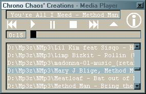



## Full Media Player

### Description

Allows Playing Of Avi, Mpeg, Mp3, Wav, And Midi Media Files. Also Allows ID3 Tagging, Drag Dropping Is Enabled, All Without The Use Of Any Ocx. Only Uses Two Api Calls: mciSendString And FloodFill. Fully Commented.
 
### More Info
 

             |
---                |---
**Submitted On**   |2001-06-17 05:08:14
**By**             |[ChronoChaos](https://github.com/Planet-Source-Code/PSCIndex/blob/master/ByAuthor/chronochaos.md)
**Level**          |Intermediate
**User Rating**    |5.0 (35 globes from 7 users)
**Compatibility**  |VB 6\.0
**Category**       |[Sound/MP3](https://github.com/Planet-Source-Code/PSCIndex/blob/master/ByCategory/sound-mp3__1-45.md)
**World**          |[Visual Basic](https://github.com/Planet-Source-Code/PSCIndex/blob/master/ByWorld/visual-basic.md)
**Archive File**   |[Full Media212596172001\.zip](https://github.com/Planet-Source-Code/chronochaos-full-media-player__1-24160/archive/master.zip)

